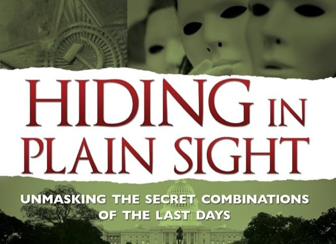

- 
# Aspiring to become a software developer? Allow me to dodge that bullet for you.
- ***Topics that will be covered***
- 1. Corruption drips from the top down.
  2. It's one cult, and you're not in it...but it's smaller than you imagine.
- 3. Websites are not your friend. Your competitor already set up shop long ago.
- 4. What makes a site happy. Something you will not have when first entering this realm. /paradox
- 5. You are being actively targeted, harassed, and sabatoged. You just haven't found out yet.
- 6. When you see signs, protect your friends, family, and reputation. Do not be afraid of judgement. Do not be silent.

I'll be taking my time. It might save a life.
